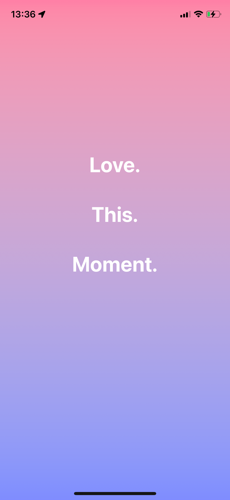
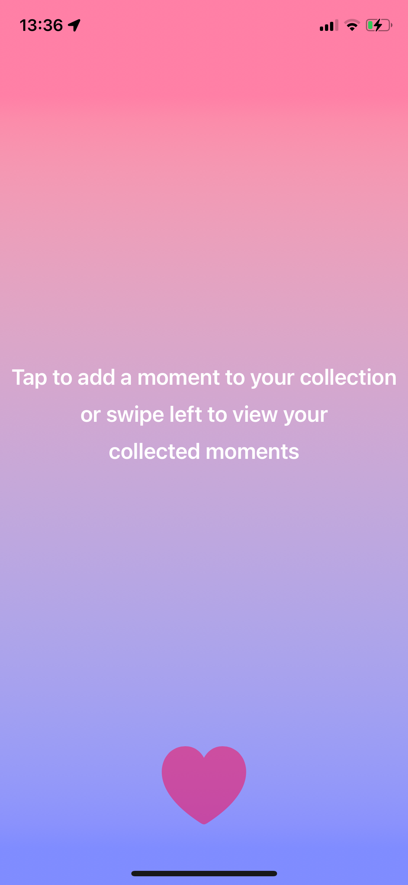
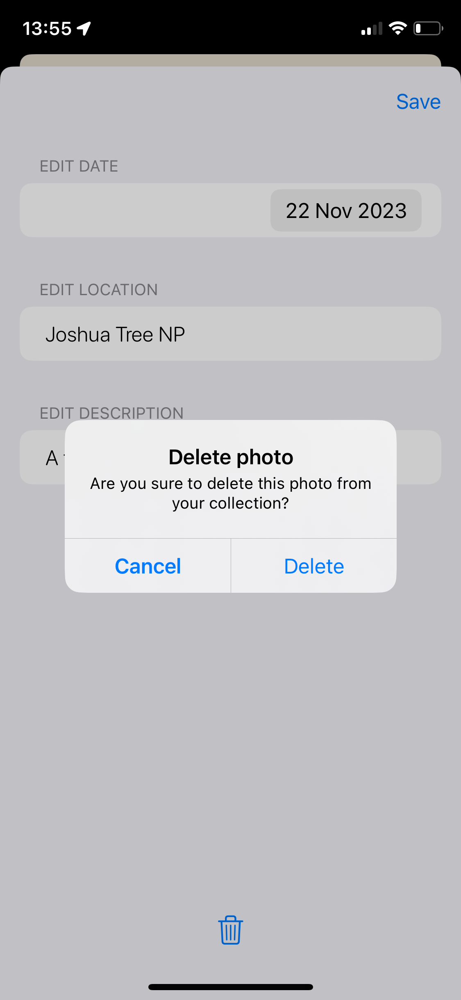
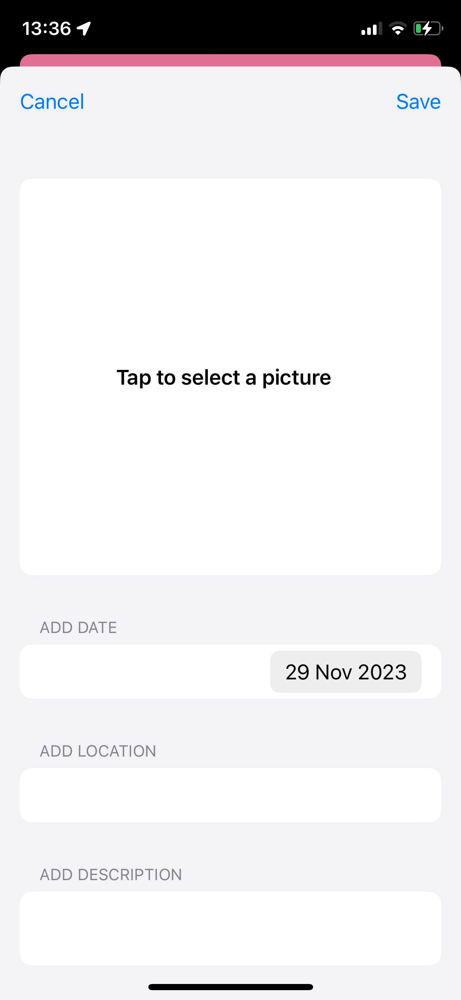
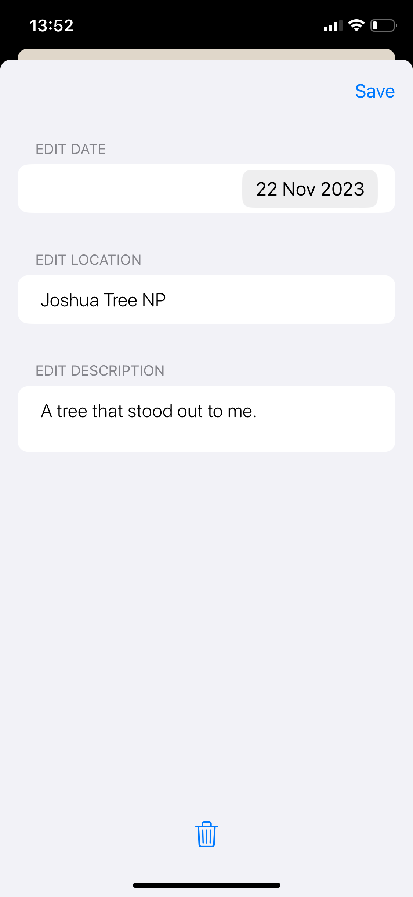
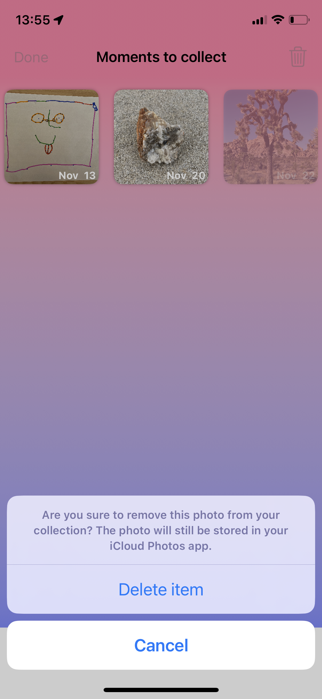

#  Love Yours

This app lets the user build a collection of value moments in the form of photos. This app makes journaling your special moments more personal by adding text to images as they would appear would you make your own physical photo album.
The experience of this app is ought to be simple, but personal.

The app can be downloaded upon request through TestFlight.

The below figures show a preview of the app.

Splash View | Enter View | Content View | Add View    
:----------:|:----------:|:------------:|:--------
 |  |  |  

Detail View | Edit View | Delete Alert | Select Button Delete
:----------:|:----------:|:-----------:|:--------------------
 |  |  | 
